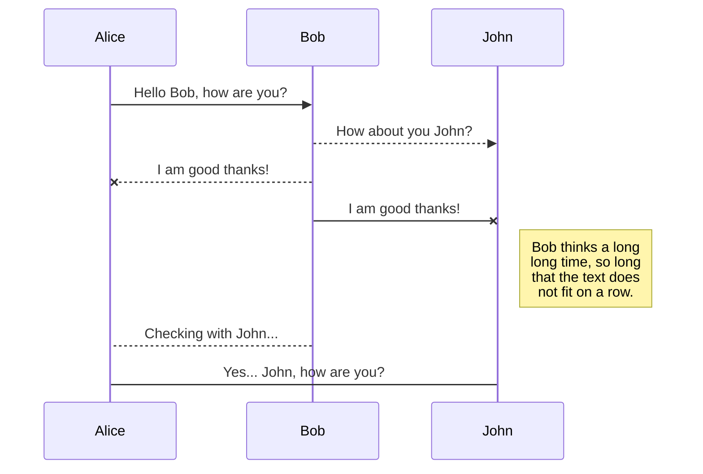
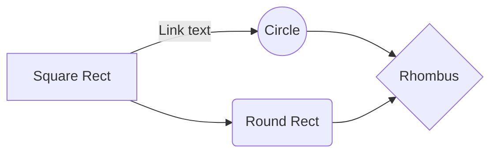

---

---

<h1 id="welcome-to-stackedit">Welcome to StackEdit!</h1>

Hi! I’m your first Markdown file in <strong>StackEdit</strong>. If you want to learn about StackEdit, you can read me. If you want to play with Markdown, you can edit me. Once you have finished with me, you can create new files by opening the <strong>file explorer</strong> on the left corner of the navigation bar.

<h1 id="files">Files</h1>

StackEdit stores your files in your browser, which means all your files are automatically saved locally and are accessible <strong>offline!</strong>

<h2 id="create-files-and-folders">Create files and folders</h2>

The file explorer is accessible using the button in left corner of the navigation bar. You can create a new file by clicking the <strong>New file</strong> button in the file explorer. You can also create folders by clicking the <strong>New folder</strong> button.

<h2 id="switch-to-another-file">Switch to another file</h2>

All your files and folders are presented as a tree in the file explorer. You can switch from one to another by clicking a file in the tree.

<h2 id="rename-a-file">Rename a file</h2>

You can rename the current file by clicking the file name in the navigation bar or by clicking the <strong>Rename</strong> button in the file explorer.

<h2 id="delete-a-file">Delete a file</h2>

You can delete the current file by clicking the <strong>Remove</strong> button in the file explorer. The file will be moved into the <strong>Trash</strong> folder and automatically deleted after 7 days of inactivity.

<h2 id="export-a-file">Export a file</h2>

You can export the current file by clicking <strong>Export to disk</strong> in the menu. You can choose to export the file as plain Markdown, as HTML using a Handlebars template or as a PDF.

<h1 id="synchronization">Synchronization</h1>

Synchronization is one of the biggest features of StackEdit. It enables you to synchronize any file in your workspace with other files stored in your <strong>Google Drive</strong>, your <strong>Dropbox</strong> and your <strong>GitHub</strong> accounts. This allows you to keep writing on other devices, collaborate with people you share the file with, integrate easily into your workflow… The synchronization mechanism takes place every minute in the background, downloading, merging, and uploading file modifications.

There are two types of synchronization and they can complement each other:

<ul>
<li>

The workspace synchronization will sync all your files, folders and settings automatically. This will allow you to fetch your workspace on any other device.

<blockquote>

To start syncing your workspace, just sign in with Google in the menu.

</blockquote>
</li>
<li>

The file synchronization will keep one file of the workspace synced with one or multiple files in <strong>Google Drive</strong>, <strong>Dropbox</strong> or <strong>GitHub</strong>.

<blockquote>

Before starting to sync files, you must link an account in the <strong>Synchronize</strong> sub-menu.

</blockquote>
</li>
</ul>
<h2 id="open-a-file">Open a file</h2>

You can open a file from <strong>Google Drive</strong>, <strong>Dropbox</strong> or <strong>GitHub</strong> by opening the <strong>Synchronize</strong> sub-menu and clicking <strong>Open from</strong>. Once opened in the workspace, any modification in the file will be automatically synced.

<h2 id="save-a-file">Save a file</h2>

You can save any file of the workspace to <strong>Google Drive</strong>, <strong>Dropbox</strong> or <strong>GitHub</strong> by opening the <strong>Synchronize</strong> sub-menu and clicking <strong>Save on</strong>. Even if a file in the workspace is already synced, you can save it to another location. StackEdit can sync one file with multiple locations and accounts.

<h2 id="synchronize-a-file">Synchronize a file</h2>

Once your file is linked to a synchronized location, StackEdit will periodically synchronize it by downloading/uploading any modification. A merge will be performed if necessary and conflicts will be resolved.

If you just have modified your file and you want to force syncing, click the <strong>Synchronize now</strong> button in the navigation bar.

<blockquote>

<strong>Note:</strong> The <strong>Synchronize now</strong> button is disabled if you have no file to synchronize.

</blockquote>
<h2 id="manage-file-synchronization">Manage file synchronization</h2>

Since one file can be synced with multiple locations, you can list and manage synchronized locations by clicking <strong>File synchronization</strong> in the <strong>Synchronize</strong> sub-menu. This allows you to list and remove synchronized locations that are linked to your file.

<h1 id="publication">Publication</h1>

Publishing in StackEdit makes it simple for you to publish online your files. Once you’re happy with a file, you can publish it to different hosting platforms like <strong>Blogger</strong>, <strong>Dropbox</strong>, <strong>Gist</strong>, <strong>GitHub</strong>, <strong>Google Drive</strong>, <strong>WordPress</strong> and <strong>Zendesk</strong>. With <a href="http://handlebarsjs.com/">Handlebars templates</a>, you have full control over what you export.

<blockquote>

Before starting to publish, you must link an account in the <strong>Publish</strong> sub-menu.

</blockquote>
<h2 id="publish-a-file">Publish a File</h2>

You can publish your file by opening the <strong>Publish</strong> sub-menu and by clicking <strong>Publish to</strong>. For some locations, you can choose between the following formats:

<ul>
<li>Markdown: publish the Markdown text on a website that can interpret it (<strong>GitHub</strong> for instance),</li>
<li>HTML: publish the file converted to HTML via a Handlebars template (on a blog for example).</li>
</ul>
<h2 id="update-a-publication">Update a publication</h2>

After publishing, StackEdit keeps your file linked to that publication which makes it easy for you to re-publish it. Once you have modified your file and you want to update your publication, click on the <strong>Publish now</strong> button in the navigation bar.

<blockquote>

<strong>Note:</strong> The <strong>Publish now</strong> button is disabled if your file has not been published yet.

</blockquote>
<h2 id="manage-file-publication">Manage file publication</h2>

Since one file can be published to multiple locations, you can list and manage publish locations by clicking <strong>File publication</strong> in the <strong>Publish</strong> sub-menu. This allows you to list and remove publication locations that are linked to your file.

<h1 id="markdown-extensions">Markdown extensions</h1>

StackEdit extends the standard Markdown syntax by adding extra <strong>Markdown extensions</strong>, providing you with some nice features.

<blockquote>

<strong>ProTip:</strong> You can disable any <strong>Markdown extension</strong> in the <strong>File properties</strong> dialog.

</blockquote>
<h2 id="smartypants">SmartyPants</h2>

SmartyPants converts ASCII punctuation characters into “smart” typographic punctuation HTML entities. For example:

<table>
<thead>
<tr>
<th></th>
<th>ASCII</th>
<th>HTML</th>
</tr>
</thead>
<tbody>
<tr>
<td>Single backticks</td>
<td><code>'Isn't this fun?'</code></td>
<td>‘Isn’t this fun?’</td>
</tr>
<tr>
<td>Quotes</td>
<td><code>"Isn't this fun?"</code></td>
<td>“Isn’t this fun?”</td>
</tr>
<tr>
<td>Dashes</td>
<td><code>-- is en-dash, --- is em-dash</code></td>
<td>– is en-dash, — is em-dash</td>
</tr>
</tbody>
</table><h2 id="katex">KaTeX</h2>

You can render LaTeX mathematical expressions using <a href="https://khan.github.io/KaTeX/">KaTeX</a>:

The <em>Gamma function</em> satisfying <math><semantics><mrow><mi mathvariant="normal">Γ</mi><mo stretchy="false">(</mo><mi>n</mi><mo stretchy="false">)</mo><mo>=</mo><mo stretchy="false">(</mo><mi>n</mi><mo>−</mo><mn>1</mn><mo stretchy="false">)</mo><mo stretchy="false">!</mo><mspace width="1em"></mspace><mi mathvariant="normal">∀</mi><mi>n</mi><mo>∈</mo><mi mathvariant="double-struck">N</mi></mrow><annotation encoding="application/x-tex">\Gamma(n) = (n-1)!\quad\forall n\in\mathbb N</annotation></semantics></math>Γ(n)=(n−1)!∀n∈N is via the Euler integral

<math><semantics><mrow><mi mathvariant="normal">Γ</mi><mo stretchy="false">(</mo><mi>z</mi><mo stretchy="false">)</mo><mo>=</mo><msubsup><mo>∫</mo><mn>0</mn><mi mathvariant="normal">∞</mi></msubsup><msup><mi>t</mi><mrow><mi>z</mi><mo>−</mo><mn>1</mn></mrow></msup><msup><mi>e</mi><mrow><mo>−</mo><mi>t</mi></mrow></msup><mi>d</mi><mi>t</mi> <mi mathvariant="normal">.</mi></mrow><annotation encoding="application/x-tex">
\Gamma(z) = \int_0^\infty t^{z-1}e^{-t}dt\,.
</annotation></semantics></math>Γ(z)=∫0∞​tz−1e−tdt.

<blockquote>

You can find more information about <strong>LaTeX</strong> mathematical expressions <a href="http://meta.math.stackexchange.com/questions/5020/mathjax-basic-tutorial-and-quick-reference">here</a>.

</blockquote>
<h2 id="uml-diagrams">UML diagrams</h2>

You can render UML diagrams using <a href="https://mermaidjs.github.io/">Mermaid</a>. For example, this will produce a sequence diagram:

<svg xmlns="http://www.w3.org/2000/svg" id="mermaid-svg-9uetLvWtDEtnOgfe" height="100%" width="100%" style="max-width:750px;" viewBox="-50 -10 750 469"><g></g><g><line id="actor3" x1="75" y1="5" x2="75" y2="458" class="actor-line" stroke-width="0.5px" stroke="#999"></line><rect x="0" y="0" fill="#eaeaea" stroke="#666" width="150" height="65" rx="3" ry="3" class="actor"></rect><text x="75" y="32.5" dominant-baseline="central" alignment-baseline="central" class="actor" style="text-anchor: middle;"><tspan x="75" dy="0">Alice</tspan></text></g><g><line id="actor4" x1="275" y1="5" x2="275" y2="458" class="actor-line" stroke-width="0.5px" stroke="#999"></line><rect x="200" y="0" fill="#eaeaea" stroke="#666" width="150" height="65" rx="3" ry="3" class="actor"></rect><text x="275" y="32.5" dominant-baseline="central" alignment-baseline="central" class="actor" style="text-anchor: middle;"><tspan x="275" dy="0">Bob</tspan></text></g><g><line id="actor5" x1="475" y1="5" x2="475" y2="458" class="actor-line" stroke-width="0.5px" stroke="#999"></line><rect x="400" y="0" fill="#eaeaea" stroke="#666" width="150" height="65" rx="3" ry="3" class="actor"></rect><text x="475" y="32.5" dominant-baseline="central" alignment-baseline="central" class="actor" style="text-anchor: middle;"><tspan x="475" dy="0">John</tspan></text></g><defs><marker id="arrowhead" refX="5" refY="2" markerWidth="6" markerHeight="4" orient="auto"><path d="M 0,0 V 4 L6,2 Z"></path></marker></defs><defs><marker id="crosshead" markerWidth="15" markerHeight="8" orient="auto" refX="16" refY="4"><path fill="black" stroke="#000000" stroke-width="1px" d="M 9,2 V 6 L16,4 Z" style="stroke-dasharray: 0, 0;"></path><path fill="none" stroke="#000000" stroke-width="1px" d="M 0,1 L 6,7 M 6,1 L 0,7" style="stroke-dasharray: 0, 0;"></path></marker></defs><g><text x="175" y="93" class="messageText" style="text-anchor: middle;">Hello Bob, how are you?</text><line x1="75" y1="100" x2="275" y2="100" class="messageLine0" stroke-width="2" stroke="black" marker-end="url(#arrowhead)" style="fill: none;"></line></g><g><text x="375" y="128" class="messageText" style="text-anchor: middle;">How about you John?</text><line x1="275" y1="135" x2="475" y2="135" class="messageLine1" stroke-width="2" stroke="black" marker-end="url(#arrowhead)" style="stroke-dasharray: 3, 3; fill: none;"></line></g><g><text x="175" y="163" class="messageText" style="text-anchor: middle;">I am good thanks!</text><line x1="275" y1="170" x2="75" y2="170" class="messageLine1" stroke-width="2" stroke="black" marker-end="url(#crosshead)" style="stroke-dasharray: 3, 3; fill: none;"></line></g><g><text x="375" y="198" class="messageText" style="text-anchor: middle;">I am good thanks!</text><line x1="275" y1="205" x2="475" y2="205" class="messageLine0" stroke-width="2" stroke="black" marker-end="url(#crosshead)" style="fill: none;"></line></g><g><rect x="500" y="215" fill="#EDF2AE" stroke="#666" width="150" height="88" rx="0" ry="0" class="note"></rect><text x="496" y="239" fill="black" class="noteText"><tspan x="516" fill="black">Bob thinks a long</tspan></text><text x="496" y="256" fill="black" class="noteText"><tspan x="516" fill="black">long time, so long</tspan></text><text x="496" y="273" fill="black" class="noteText"><tspan x="516" fill="black">that the text does</tspan></text><text x="496" y="290" fill="black" class="noteText"><tspan x="516" fill="black">not fit on a row.</tspan></text></g><g><text x="175" y="331" class="messageText" style="text-anchor: middle;">Checking with John...</text><line x1="275" y1="338" x2="75" y2="338" class="messageLine1" stroke-width="2" stroke="black" style="stroke-dasharray: 3, 3; fill: none;"></line></g><g><text x="275" y="366" class="messageText" style="text-anchor: middle;">Yes... John, how are you?</text><line x1="75" y1="373" x2="475" y2="373" class="messageLine0" stroke-width="2" stroke="black" style="fill: none;"></line></g><g><rect x="0" y="393" fill="#eaeaea" stroke="#666" width="150" height="65" rx="3" ry="3" class="actor"></rect><text x="75" y="425.5" dominant-baseline="central" alignment-baseline="central" class="actor" style="text-anchor: middle;"><tspan x="75" dy="0">Alice</tspan></text></g><g><rect x="200" y="393" fill="#eaeaea" stroke="#666" width="150" height="65" rx="3" ry="3" class="actor"></rect><text x="275" y="425.5" dominant-baseline="central" alignment-baseline="central" class="actor" style="text-anchor: middle;"><tspan x="275" dy="0">Bob</tspan></text></g><g><rect x="400" y="393" fill="#eaeaea" stroke="#666" width="150" height="65" rx="3" ry="3" class="actor"></rect><text x="475" y="425.5" dominant-baseline="central" alignment-baseline="central" class="actor" style="text-anchor: middle;"><tspan x="475" dy="0">John</tspan></text></g></svg>

And this will produce a flow chart:

<svg xmlns="http://www.w3.org/2000/svg" id="mermaid-svg-ZS8i9QRZkn19DNkE" width="100%" style="max-width: 500.3109359741211px;" viewBox="0 0 500.3109359741211 171.890625"><g transform="translate(-12, -12)"><g class="output"><g class="clusters"></g><g class="edgePaths"><g class="edgePath" style="opacity: 1;"><path class="path" d="M119.91170576572816,78.41796875L179.3203125,49.9453125L255.2578125,49.9453125" marker-end="url(#arrowhead33)" style="fill:none"></path><defs><marker id="arrowhead33" viewBox="0 0 10 10" refX="9" refY="5" markerUnits="strokeWidth" markerWidth="8" markerHeight="6" orient="auto"><path d="M 0 0 L 10 5 L 0 10 z" class="arrowheadPath" style="stroke-width: 1; stroke-dasharray: 1, 0;"></path></marker></defs></g><g class="edgePath" style="opacity: 1;"><path class="path" d="M119.91170576572816,124.41796875L179.3203125,152.890625L234.796875,152.890625" marker-end="url(#arrowhead34)" style="fill:none"></path><defs><marker id="arrowhead34" viewBox="0 0 10 10" refX="9" refY="5" markerUnits="strokeWidth" markerWidth="8" markerHeight="6" orient="auto"><path d="M 0 0 L 10 5 L 0 10 z" class="arrowheadPath" style="stroke-width: 1; stroke-dasharray: 1, 0;"></path></marker></defs></g><g class="edgePath" style="opacity: 1;"><path class="path" d="M315.1484375,49.9453125L360.609375,49.9453125L408.6013871293077,79.42595738363185" marker-end="url(#arrowhead35)" style="fill:none"></path><defs><marker id="arrowhead35" viewBox="0 0 10 10" refX="9" refY="5" markerUnits="strokeWidth" markerWidth="8" markerHeight="6" orient="auto"><path d="M 0 0 L 10 5 L 0 10 z" class="arrowheadPath" style="stroke-width: 1; stroke-dasharray: 1, 0;"></path></marker></defs></g><g class="edgePath" style="opacity: 1;"><path class="path" d="M335.609375,152.890625L360.609375,152.890625L408.6013861816871,124.4099806946266" marker-end="url(#arrowhead36)" style="fill:none"></path><defs><marker id="arrowhead36" viewBox="0 0 10 10" refX="9" refY="5" markerUnits="strokeWidth" markerWidth="8" markerHeight="6" orient="auto"><path d="M 0 0 L 10 5 L 0 10 z" class="arrowheadPath" style="stroke-width: 1; stroke-dasharray: 1, 0;"></path></marker></defs></g></g><g class="edgeLabels"><g class="edgeLabel" transform="translate(179.3203125,49.9453125)" style="opacity: 1;"><g transform="translate(-30.4765625,-13)" class="label"><foreignObject width="60.953125" height="26">
Link text
</foreignObject></g></g><g class="edgeLabel" transform="" style="opacity: 1;"><g transform="translate(0,0)" class="label"><foreignObject width="0" height="0">

</foreignObject></g></g><g class="edgeLabel" transform="" style="opacity: 1;"><g transform="translate(0,0)" class="label"><foreignObject width="0" height="0">

</foreignObject></g></g><g class="edgeLabel" transform="" style="opacity: 1;"><g transform="translate(0,0)" class="label"><foreignObject width="0" height="0">

</foreignObject></g></g></g><g class="nodes"><g class="node" id="A" transform="translate(71.921875,101.41796875)" style="opacity: 1;"><rect rx="0" ry="0" x="-51.921875" y="-23" width="103.84375" height="46"></rect><g class="label" transform="translate(0,0)"><g transform="translate(-41.921875,-13)"><foreignObject width="83.84375" height="26">
Square Rect
</foreignObject></g></g></g><g class="node" id="B" transform="translate(285.203125,49.9453125)" style="opacity: 1;"><circle x="-29.9453125" y="-23" r="29.9453125"></circle><g class="label" transform="translate(0,0)"><g transform="translate(-19.9453125,-13)"><foreignObject width="39.890625" height="26">
Circle
</foreignObject></g></g></g><g class="node" id="C" transform="translate(285.203125,152.890625)" style="opacity: 1;"><rect rx="5" ry="5" x="-50.40625" y="-23" width="100.8125" height="46"></rect><g class="label" transform="translate(0,0)"><g transform="translate(-40.40625,-13)"><foreignObject width="80.8125" height="26">
Round Rect
</foreignObject></g></g></g><g class="node" id="D" transform="translate(444.96015548706055,101.41796875)" style="opacity: 1;"><polygon points="59.350781250000004,0 118.70156250000001,-59.350781250000004 59.350781250000004,-118.70156250000001 0,-59.350781250000004" rx="5" ry="5" transform="translate(-59.350781250000004,59.350781250000004)"></polygon><g class="label" transform="translate(0,0)"><g transform="translate(-32.9453125,-13)"><foreignObject width="65.890625" height="26">
Rhombus
</foreignObject></g></g></g></g></g></g></svg>

# Welcome to StackEdit!

Hi! I'm your first Markdown file in **StackEdit**. If you want to learn about StackEdit, you can read me. If you want to play with Markdown, you can edit me. Once you have finished with me, you can create new files by opening the **file explorer** on the left corner of the navigation bar.

# Files

StackEdit stores your files in your browser, which means all your files are automatically saved locally and are accessible **offline!**

## Create files and folders

The file explorer is accessible using the button in left corner of the navigation bar. You can create a new file by clicking the **New file** button in the file explorer. You can also create folders by clicking the **New folder** button.

## Switch to another file

All your files and folders are presented as a tree in the file explorer. You can switch from one to another by clicking a file in the tree.

## Rename a file

You can rename the current file by clicking the file name in the navigation bar or by clicking the **Rename** button in the file explorer.

## Delete a file

You can delete the current file by clicking the **Remove** button in the file explorer. The file will be moved into the **Trash** folder and automatically deleted after 7 days of inactivity.

## Export a file

You can export the current file by clicking **Export to disk** in the menu. You can choose to export the file as plain Markdown, as HTML using a Handlebars template or as a PDF.

# Synchronization

Synchronization is one of the biggest features of StackEdit. It enables you to synchronize any file in your workspace with other files stored in your **Google Drive**, your **Dropbox** and your **GitHub** accounts. This allows you to keep writing on other devices, collaborate with people you share the file with, integrate easily into your workflow... The synchronization mechanism takes place every minute in the background, downloading, merging, and uploading file modifications.

There are two types of synchronization and they can complement each other:

- The workspace synchronization will sync all your files, folders and settings automatically. This will allow you to fetch your workspace on any other device.
	> To start syncing your workspace, just sign in with Google in the menu.

- The file synchronization will keep one file of the workspace synced with one or multiple files in **Google Drive**, **Dropbox** or **GitHub**.
	> Before starting to sync files, you must link an account in the **Synchronize** sub-menu.

## Open a file

You can open a file from **Google Drive**, **Dropbox** or **GitHub** by opening the **Synchronize** sub-menu and clicking **Open from**. Once opened in the workspace, any modification in the file will be automatically synced.

## Save a file

You can save any file of the workspace to **Google Drive**, **Dropbox** or **GitHub** by opening the **Synchronize** sub-menu and clicking **Save on**. Even if a file in the workspace is already synced, you can save it to another location. StackEdit can sync one file with multiple locations and accounts.

## Synchronize a file

Once your file is linked to a synchronized location, StackEdit will periodically synchronize it by downloading/uploading any modification. A merge will be performed if necessary and conflicts will be resolved.

If you just have modified your file and you want to force syncing, click the **Synchronize now** button in the navigation bar.

> **Note:** The **Synchronize now** button is disabled if you have no file to synchronize.

## Manage file synchronization

Since one file can be synced with multiple locations, you can list and manage synchronized locations by clicking **File synchronization** in the **Synchronize** sub-menu. This allows you to list and remove synchronized locations that are linked to your file.

# Publication

Publishing in StackEdit makes it simple for you to publish online your files. Once you're happy with a file, you can publish it to different hosting platforms like **Blogger**, **Dropbox**, **Gist**, **GitHub**, **Google Drive**, **WordPress** and **Zendesk**. With [Handlebars templates](http://handlebarsjs.com/), you have full control over what you export.

> Before starting to publish, you must link an account in the **Publish** sub-menu.

## Publish a File

You can publish your file by opening the **Publish** sub-menu and by clicking **Publish to**. For some locations, you can choose between the following formats:

- Markdown: publish the Markdown text on a website that can interpret it (**GitHub** for instance),
- HTML: publish the file converted to HTML via a Handlebars template (on a blog for example).

## Update a publication

After publishing, StackEdit keeps your file linked to that publication which makes it easy for you to re-publish it. Once you have modified your file and you want to update your publication, click on the **Publish now** button in the navigation bar.

> **Note:** The **Publish now** button is disabled if your file has not been published yet.

## Manage file publication

Since one file can be published to multiple locations, you can list and manage publish locations by clicking **File publication** in the **Publish** sub-menu. This allows you to list and remove publication locations that are linked to your file.

# Markdown extensions

StackEdit extends the standard Markdown syntax by adding extra **Markdown extensions**, providing you with some nice features.

> **ProTip:** You can disable any **Markdown extension** in the **File properties** dialog.

## SmartyPants

SmartyPants converts ASCII punctuation characters into "smart" typographic punctuation HTML entities. For example:

|                |ASCII                          |HTML                         |
|----------------|-------------------------------|-----------------------------|
|Single backticks|`'Isn't this fun?'`            |'Isn't this fun?'            |
|Quotes          |`"Isn't this fun?"`            |"Isn't this fun?"            |
|Dashes          |`-- is en-dash, --- is em-dash`|-- is en-dash, --- is em-dash|

## KaTeX

You can render LaTeX mathematical expressions using [KaTeX](https://khan.github.io/KaTeX/):

The *Gamma function* satisfying $\Gamma(n) = (n-1)!\quad\forall n\in\mathbb N$ is via the Euler integral

$$
\Gamma(z) = \int_0^\infty t^{z-1}e^{-t}dt\,.
$$

> You can find more information about **LaTeX** mathematical expressions [here](http://meta.math.stackexchange.com/questions/5020/mathjax-basic-tutorial-and-quick-reference).

## UML diagrams

You can render UML diagrams using [Mermaid](https://mermaidjs.github.io/). For example, this will produce a sequence diagram:

And this will produce a flow chart:

<!DOCTYPE html>
<html lang="en">

<head>

  <meta charset='UTF-8'>
  <meta name="viewport" content="width=device-width, initial-scale=1, shrink-to-fit=no">
  <link rel="shortcut icon" href="img/crystal.ico">
  <meta name="description" content="">
  <meta name="author" content="">

  <title>Carmen Liu -Clinical Psychologist</title>

  <!-- Bootstrap core CSS -->
  <link href="vendor/bootstrap/css/bootstrap.min.css" rel="stylesheet">

  <!-- Custom fonts for this template -->
  <link href="https://fonts.googleapis.com/css?family=Saira+Extra+Condensed:500,700" rel="stylesheet">
  <link href="https://fonts.googleapis.com/css?family=Muli:400,400i,800,800i" rel="stylesheet">
  <link href="vendor/fontawesome-free/css/all.min.css" rel="stylesheet">

  <!-- Custom styles for this template -->
  <link href="css/resume.min.css" rel="stylesheet">

</head>

<body id="page-top">
  <nav class="navbar navbar-expand-lg navbar-dark bg-primary fixed-top" id="sideNav">
    <a class="navbar-brand js-scroll-trigger" href="#page-top">
      Carmen Liu
      
        
      
    </a>
    <button class="navbar-toggler" type="button" data-toggle="collapse" data-target="#navbarSupportedContent" aria-controls="navbarSupportedContent" aria-expanded="false" aria-label="Toggle navigation">
      
    </button>
    

      <ul class="navbar-nav">
        <li class="nav-item">
          <a class="nav-link js-scroll-trigger" href="#about">About</a>
        </li>
        <li class="nav-item">
          <a class="nav-link js-scroll-trigger" href="#experience">Experience</a>
        </li>
        <li class="nav-item">
          <a class="nav-link js-scroll-trigger" href="#education">Education</a>
        </li>
        <li class="nav-item">
          <a class="nav-link js-scroll-trigger" href="#portfolio">Portfolio</a>
        </li>
      </ul>
    

  

  </nav>

  

    <section class="resume-section p-3 p-lg-5 d-flex align-items-center" id="about">
      

        <h1 class="mb-3">Carmen Liu
        </h1>
        
Psychology

        
I am a fourth year undergraduate student and I take interest in helping others. Many of my job experiences involve customer service and active relationship building. 
        I intend to take these experiences as stepping stones to further my chances of one day becoming a clinical psychologist. Currently, I am a research assistant in a psychology lab at the
        University of California, Riverside. The overall skills I have learned such as team work, communcation, and effective efficiency has strengthened my work ethic.    

        Enter bio here  

        Enter bio here
        

        

          <a target="_blank" href="https://www.linkedin.com/in/carmen-liu-3a0990140/">
            <i class="fab fa-linkedin-in"></i>
          </a>
          <a target="_blank" href="https://github.com/cliu074/Carmen-liu">
            <i class="fab fa-github"></i>
          </a>
          <a target="_blank" href="cliu074@ucr.edu">
            <i class="fa fa-envelope"></i>
          </a>
        

      

    </section>

    

    <section class="resume-section p-3 p-lg-5 d-flex justify-content-center" id="experience">
      

        <h2 class="mb-5">Experience</h2>

        

          

            <h3 class="mb-0">Food Server</h3>
            
<a target="_blank" href="https://mulesoft.com">Poke Bar</a>

            

              • Achieved a great customer experience by interacting with as many customers each day has increasingly improved speaking and communication skills.  
              • Maintained organization and time management skills by consistently restocking materials, managing wait times and cleaning restrooms. 
            

          

          

            August 2017 - Feburary 2018
          

        

        

          

            <h3 class="mb-0">Sales Associate</h3>
            
<a target="_blank" href="https://pubnub.com">Pacific Sunwear</a>

            

              • Worked collaboratively with team members to drive customer service initiatives and achieving sales goals. 
              • Liaised with customers, recommending specific products and specials in alignment with individual needs, requirements and specifications. 
              • Interacting with different individuals as a Sales Associate has enhanced my attentiveness, creativity, multi-tasking skills and ability to develop long lasting customer relationships. 
            

          

          

            September 2015 - January 2016
          

        

        

          

            <h3 class="mb-0">Floral Assistant</h3>
            
<a target="_blank" href="https://ucr.edu">Joann Cai Wedding Arrangements</a>

            

            • Met with clients to discuss specific details about the floral arrangements to develop the best design tailored to their individual needs.
            • Ensured superior customer experience by addressing customer concerns, demonstrating empathy and resolving problems swiftly. 

          

          

          

            November 2014 - April 2015
          

        

      

    </section>

    

    <section class="resume-section p-3 p-lg-5 d-flex align-items-center" id="education">
      

        <h2 class="mb-5">Education</h2>

        

          

            <h3 class="mb-0">UC Riverside</h3>
            
Bachelors of Art in Psychology

          

          

            September 2016 - March 2020
          

        

       

       
        

      

    </section>

    

    <section class="resume-section p-1 p-lg-5 d-flex align-items-center" id="portfolio">
      

        <h2 class="mb-5">Portfolio</h1>
        

            
              
            
              
             
               
        

      

    </section>

    

    
&copy;  Carmen Liu
 

  

  

  <!-- Bootstrap core JavaScript -->
  
  

  <!-- Plugin JavaScript -->
  

  <!-- Custom scripts for this template -->
  

</body>

</html>

<!--stackedit_data:
eyJoaXN0b3J5IjpbMTkwNTEzODg5MSw1NzU1MDc1MzcsMTQxMD
c3MTY4M119
-->